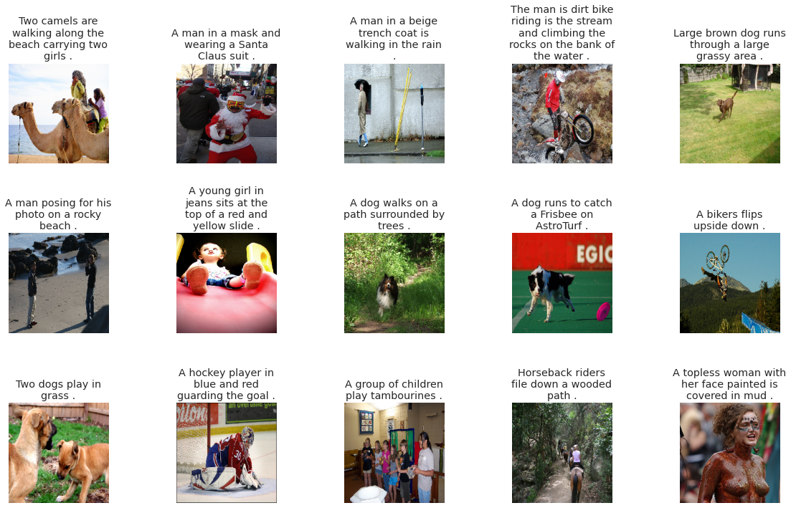
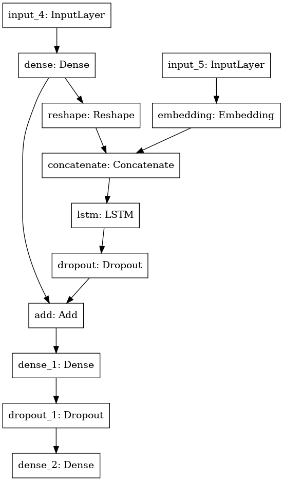
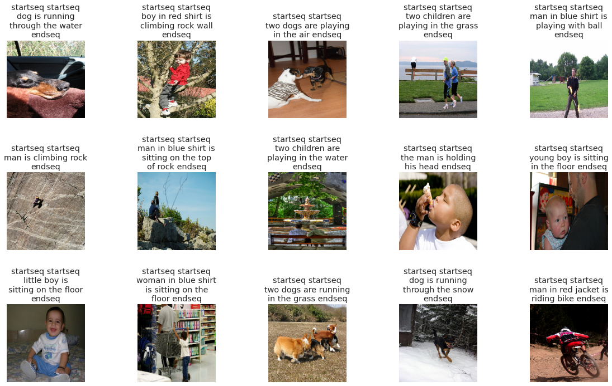

## Image Caption Generator

This project is an Image Caption Generator that uses a pre-trained DenseNet201 model for image feature extraction and an LSTM-based model for generating descriptive captions. The model is designed to take an image as input and produce a human-readable caption, allowing the system to describe visual content automatically.


## Table of Contents

- [Overview](#overview)
- [Features](#features)
- [Project Structure](#project-structure)
- [Installation](#installation)
- [Dataset](#dataset)
- [Model Architecture](#model-architecture)
- [Results](#results)
- [Contributing](#contributing)
- [License](#license)

## Overview

The Image Caption Generator project combines **Convolutional Neural Networks (CNN)** for feature extraction with **Recurrent Neural Networks (RNN)** for sequence generation. The feature extraction leverages DenseNet201, which captures rich image features, while the RNN (LSTM) model generates a sequence of words based on these features to describe the image.

This project could be applied in fields like accessibility for the visually impaired, image indexing, and automatic image tagging for content management.


## Features

- Extracts high-level image features using DenseNet201.
- Generates human-like captions based on extracted features.
- Provides efficient batch processing for caption generation.
- Preprocesses and cleans text data for accurate predictions.


## Installation


1. **Clone the repository:**
   ```bash
   git clone https://github.com/rupankar-02/image-caption-generator.git
   cd image-caption-generator

## Dataset
This project is compatible with popular image captioning datasets. Ensure your dataset includes an `images` folder with images and a text file with image filenames and corresponding captions.

- [Flickr8k Dataset](https://forms.illinois.edu/sec/1713398)
- [MSCOCO Dataset](http://cocodataset.org/)



## Model Architecture

1. **Feature Extraction**: 
   - DenseNet201 is used to extract high-level features from images.

2. **Sequence Generation**: 
   - An LSTM-based model predicts the next word in the sequence, given the extracted features and previously generated words.

3. **Text Processing**: 
   - Tokenization and padding are applied to convert captions into sequences.





## Results 


